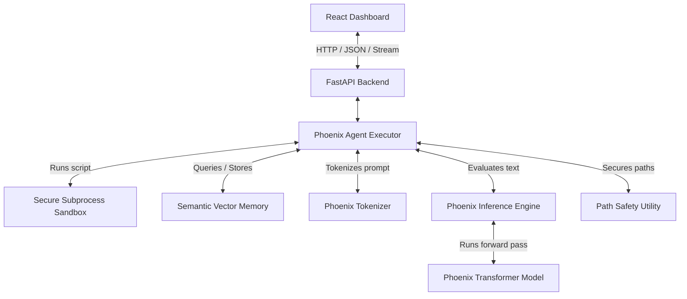

# Phoenix AI Architecture

This document describes the system design and architecture of Phoenix AI v2.0.

## 1. Tokenizer (BPE)
- **Model**: Byte-Level BPE (Byte Pair Encoding) tokenizer trained directly on the codebase.
- **Vocabulary Size**: 32,000 max size. Contains fallback parameters.
- **Special Tokens**: 
  - `<|endoftext|>`: End of sequence / Beginning of sequence
  - `<|pad|>`: Sequence padding
  - `<|system|>`: System prompt boundary
  - `<|user|>`: User prompt boundary
  - `<|assistant|>`: Assistant response boundary
  - `<|tool_call|>`: Code/File execution block
  - `<|tool_response|>`: Standard output feedback from executed sandbox

## 2. Transformer Decoder
- **Design**: Causal Decoder-Only Transformer.
- **Layers**: 8 transformer blocks (configurable).
- **Hidden Size**: 512 dimensions.
- **Attention Heads**: 8 heads (64 head dimensions each).
- **RoPE (Rotary Position Embeddings)**: Precomputed rotary embeddings applied to key/query projections.
- **RMSNorm**: Root Mean Square Layer Normalization applied pre-attention and pre-feedforward for training stability.
- **SwiGLU Activation**: Used in the FeedForward block to replace standard MLP, increasing capacity.
- **Weight-Tying**: The embedding layer weights are tied directly to the output projection weights to minimize VRAM footprint.

## 3. Inference Engine
- **KV Cache**: Key/Value states of historical sequence tokens are cached to avoid quadratic recomputation during auto-regressive generation.
- **Filtering**: Supports Temperature scaling, Top-K filtering, and Top-P (Nucleus) sampling for stochastic generation.
- **Fallback**: Fallback mock-stream generator handles cold-start/untrained model scenarios.

## 4. Semantic Vector Memory (Vectorized v2.0)
- **Database**: In-memory JSON database (`memory_db.json`), loaded relative to workspace directories dynamically.
- **Embeddings**: Generated using mean-pooling of the token embeddings inside the model's own weights.
- **Search (Vectorized)**: Cosine-similarity calculation vectorized via PyTorch matrix-vector multiplication (`torch.mv`) on a stacked 2D tensor cache, optimizing search performance to O(1) vectorized complexity.

## 5. Agent & Sandbox Execution (Hardened v2.0)
- **Agent Loop**: RegEx matches `<execute_code>`, `<read_file>`, and `<write_file>` tags from model output. Runs tools, and appends outputs back to the context.
- **Path Safety**: External shared `resolve_safe_path` utility prevents directory traversal attacks by validating and restricting file access within workspace boundaries.
- **Sandbox Isolation & Hardening**:
  - Launches separate Python subprocesses using unique temporary filenames (`sandbox_run_*.py`) to prevent race conditions during concurrent runs.
  - Clears `PATH` and blocks dangerous network/process parameters by restricting `env`.
  - Enforces time limits (`timeout`) to avoid infinite loops.
  - Hardened write-blocking regex patterns to reject any external file writes (`open('w')`, `io.open`, `Path.write_text`, `shutil.copy` etc.) outside the sandboxed area.
