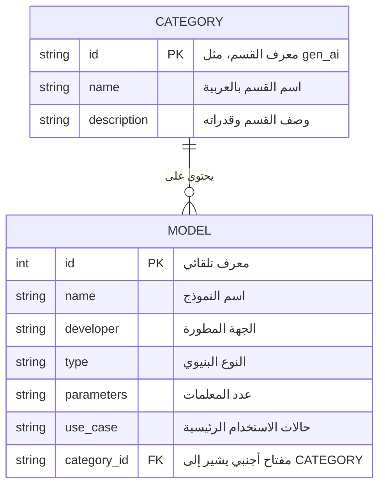

# مستند المواصفات الفنية المتكامل لنظام مستكشف الذكاء الاصطناعي (AI Explorer Specifications)

يوفر هذا المستند مرجعاً شاملاً وتوثيقاً كاملاً لبنية، وتصميم، وتشغيل، ونشر نظام **مستكشف ومصنف أنواع الذكاء الاصطناعي**.

---

## 1. هندسة الأوامر وتوجيه النظام (Prompt Engineering & System Prompt)

### توجيه النظام (System Prompt)
يُستخدم هذا التوجيه لتهيئة نماذج اللغة الكبيرة (LLMs) لتصنيف استعلامات المستخدمين بدقة واقتراح النماذج المناسبة:
```text
Role: مصنف ومستشار تقني خبير في هندسة وهياكل الذكاء الاصطناعي.
Instructions:
- مهمتك هي تصنيف أي سؤال أو طلب مستخدم يتعلق بنماذج أو تقنيات الذكاء الاصطناعي إلى أحد الأقسام الأربعة الرئيسية:
  1. الذكاء الاصطناعي التوليدي (gen_ai)
  2. معالجة اللغات الطبيعية (nlp)
  3. الرؤية الحاسوبية (computer_vision)
  4. التعلم التعزيزي (reinforcement_learning)
- قدم إجابات منظمة للغاية تحتوي على:
  - القسم الرئيسي المناسب.
  - النماذج الشائعة لحل المشكلة.
  - المعلمات (Parameters) المقترحة للتشغيل.
- إذا كان السؤال خارج نطاق هذه الأقسام، صنفه كـ "غير معروف" (unknown).
Format: أرجع النتيجة دائماً بصيغة JSON نظيفة ومطابقة للمواصفات التالية:
{
  "category_id": "gen_ai | nlp | computer_vision | reinforcement_learning | unknown",
  "confidence": 0.0 to 1.0,
  "suggested_models": ["model_name_1", "model_name_2"],
  "explanation": "سبب التصنيف والترشيح"
}
```

### سياق سير العمل وتدفق البيانات (Workflow & Orchestration)
تتبع معالجة الطلبات تدفقاً متسلسلاً باستخدام مبدأ السلسلة (Chaining):
1. **استقبال المدخلات**: استقبال النص المدخل من واجهة المستخدم.
2. **التحليل الأمني**: تمرير النص على وحدة فحص حقن الأوامر (`is_prompt_injection`).
3. **البحث الدلالي (RAG)**: استعلام قاعدة البيانات المتجهة (Vector Store) عن تفاصيل مطابقة في ملف `ai_data.json`.
4. **حقن السياق وصياغة المخرجات**: دمج نتائج RAG مع التوجيه الأساسي وإخراج توصية ذكية للعميل.

---

## 2. مواصفات قاعدة البيانات ومخطط العلاقات (Database ERD)

يتم تنظيم بيانات مستكشف الذكاء الاصطناعي عبر علاقة (One-to-Many) بين الأقسام والنماذج:



---

## 3. مواصفات واجهات البرمجة (API Specifications - OpenAPI)

```yaml
openapi: 3.0.3
info:
  title: AI Explorer API
  version: 1.0.0
  description: واجهات برمجة تفاعلية للبحث عن أقسام ونماذج الذكاء الاصطناعي وإضافتها.
paths:
  /api/ai_explorer/search:
    get:
      summary: البحث وتصفية النماذج والأقسام
      parameters:
        - name: query
          in: query
          required: false
          schema:
            type: string
          description: نص البحث في الأسماء والمطورين وحالات الاستخدام
        - name: category_id
          in: query
          required: false
          schema:
            type: string
          description: تصفية النتائج لقسم محدد فقط
      responses:
        '200':
          description: قائمة الأقسام مع النماذج المطابقة
          content:
            application/json:
              schema:
                type: object
                properties:
                  categories:
                    type: array
                    items:
                      $ref: '#/components/schemas/Category'

  /api/ai_explorer/add:
    post:
      summary: إضافة نموذج ذكاء اصطناعي جديد
      requestBody:
        required: true
        content:
          application/json:
            schema:
              $ref: '#/components/schemas/AIModelAddRequest'
      responses:
        '200':
          description: تم إضافة النموذج بنجاح
        '404':
          description: القسم المستهدف غير موجود

components:
  schemas:
    Category:
      type: object
      properties:
        id:
          type: string
        name:
          type: string
        description:
          type: string
        models:
          type: array
          items:
            $ref: '#/components/schemas/AIModel'
    AIModel:
      type: object
      properties:
        name:
          type: string
        developer:
          type: string
        type:
          type: string
        parameters:
          type: string
        use_case:
          type: string
    AIModelAddRequest:
      type: object
      required:
        - category_id
        - name
        - developer
        - type
        - use_case
      properties:
        category_id:
          type: string
        name:
          type: string
        developer:
          type: string
        type:
          type: string
        parameters:
          type: string
        use_case:
          type: string
```

---

## 4. قصص المستخدمين وشروط القبول (User Stories)

### قصة المستخدم 1: البحث الفوري والتصفية
- **بصفتي**: مهندس برمجيات مهتم بالذكاء الاصطناعي.
- **أريد أن**: أبحث في محرك تصفية الأقسام للوصول إلى النماذج التي طورتها جهة معينة (مثل Google) أو تدعم استخداماً محدداً.
- **حتى أتمكن من**: مقارنة الخيارات المتوفرة بسرعة.
- **شروط القبول**:
  - يحتوي التبويب على حقل نصي للبحث يستجيب فوراً لكل مدخل أثناء الكتابة.
  - توفر فلاتر علوية سريعة (Pills) للتنقل بين الأقسام الأربعة وتحديدها.

### قصة المستخدم 2: إضافة نموذج جديد
- **بصفتي**: مسؤول قاعدة البيانات المعرفية.
- **أريد أن**: أقوم بإضافة طراز أو نموذج ذكاء اصطناعي جديد تم إطلاقه حديثاً.
- **حتى أتمكن من**: إبقاء المنصة محدثة.
- **شروط القبول**:
  - يتوفر زر "إضافة نموذج جديد" يفتح واجهة إدخال منبثقة (Modal).
  - الحقول الإلزامية محددة بنجمة حمراء ويتم التحقق من إدخالها قبل الإرسال.
  - عند النجاح، يتم إغلاق النافذة وتحديث الجدول وتنبيه المستخدم بإشعار Toast.

---

## 5. خطة وحالات الاختبار (Test Plan & Cases)

| رقم الحالة | الهدف من الاختبار | المدخلات المتوقعة | النتيجة المطلوبة | رمز الحالة |
| :--- | :--- | :--- | :--- | :--- |
| **TC_01** | البحث عن نموذج موجود | `query="GPT-4"` | مصفوفة تحتوي على نموذج GPT-4 | `200 OK` |
| **TC_02** | تصفية حسب قسم محدد | `category_id="nlp"` | عرض قسم NLP ونماذجه فقط | `200 OK` |
| **TC_03** | إضافة نموذج بنجاح | بيانات نموذج صالحة كاملة | إضافة النموذج وحفظه ذرياً | `200 OK` |
| **TC_04** | إضافة لقسم غير موجود | `category_id="unknown_id"` | رسالة خطأ صريحة | `404 Not Found` |

---

## 6. دليل الألوان والتصميم (UI/UX Style Guide)

يتبع قسم مستكشف الذكاء الاصطناعي نفس فلسفة التصميم المعتمدة في منصة Phoenix:
- **الخلفيات (Backgrounds)**:
  - لون الخلفية الأساسي: `var(--bg-base)` (#030712 - رمادي غامق جداً)
  - لون خلفية البطاقات: `var(--bg-surface)` (#0f172a - أزرق غامق داكن)
- **الألوان المميزة (Accent Colors)**:
  - اللون البنفسجي المضيء للرموز والعناوين: `var(--accent-1)`
  - اللون الأخضر/السيان للأرقام والبارامترات: `var(--accent-2)`
- **الخطوط**: عائلة الخطوط الأساسية الخالية من الزوائد (sans-serif) مع خطوط أحادية المسافة لعرض البارامترات والأكواد.

---

## 7. ملفات الترجمة واللغات (i18n Translation Files)

### النسخة العربية (`ar.json`)
```json
{
  "ai_explorer": {
    "title": "مستكشف أنواع الذكاء الاصطناعي",
    "subtitle": "تصفح، ابحث، وصنف أقسام ونماذج الذكاء الاصطناعي المختلفة وقدراتها التشغيلية.",
    "add_button": "إضافة نموذج جديد",
    "search_placeholder": "ابحث عن النماذج، المطورين، أو حالات الاستخدام...",
    "model_name": "اسم النموذج",
    "developer": "المطور",
    "structure_type": "النوع البنيوي",
    "parameters": "عدد المعلمات",
    "use_case": "حالة الاستخدام الرئيسية",
    "cancel": "إلغاء",
    "add_success": "تمت إضافة النموذج بنجاح!"
  }
}
```

### النسخة الإنجليزية (`en.json`)
```json
{
  "ai_explorer": {
    "title": "AI Types Explorer",
    "subtitle": "Browse, search, and classify AI categories, models, and capabilities.",
    "add_button": "Add New Model",
    "search_placeholder": "Search models, developers, or use cases...",
    "model_name": "Model Name",
    "developer": "Developer",
    "structure_type": "Structure Type",
    "parameters": "Parameters Count",
    "use_case": "Primary Use Case",
    "cancel": "Cancel",
    "add_success": "Model added successfully!"
  }
}
```

---

## 8. دليل المستخدم النهائي (User Manual)

### تصفح الأقسام والبحث
1. انقر على خيار **مستكشف الذكاء الاصطناعي** في القائمة الجانبية.
2. تصفح بطاقات التصنيفات الأربعة المعروضة بشكل مرتب.
3. استخدم شريط البحث العلوي لتضييق النطاق؛ حيث يبحث النظام تلقائياً في (اسم النموذج، المطور، وحالة الاستخدام).
4. اضغط على أزرار التصفية السريعة لعرض قسم واحد فقط أو كافة الأقسام معاً.

### إضافة نموذج جديد
1. انقر على زر **إضافة نموذج جديد** في الزاوية العلوية اليسرى.
2. حدد القسم المستهدف بدقة من القائمة المنسدلة.
3. املأ البيانات المطلوبة (الاسم، المطور، النوع، حالات الاستخدام).
4. اضغط على **إضافة النموذج**. سيتم التحقق من البيانات فوراً وتحديث الجداول بنجاح.
