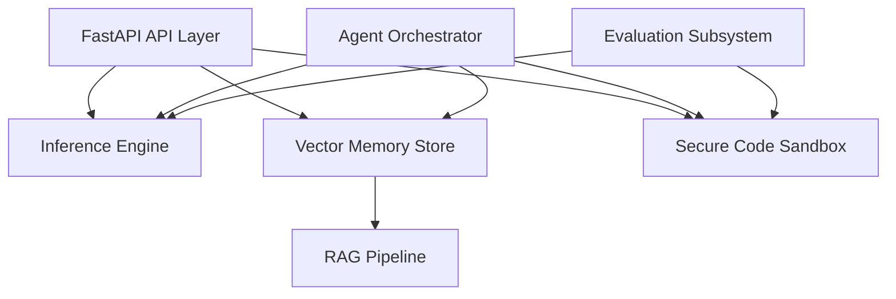

# Phoenix AGI — Architecture Report (v7.0.0)

This report reviews the modular, decoupled architecture of the Phoenix AGI Platform.

---

## 1. System Topology

Phoenix AGI is organized as a decoupled, local-first AI platform with separate layers for foundation model operations, runtime execution, vector memory retrieval, orchestration, and evaluation.

---

## 2. Component Review

### 2.1 Foundation Model & Optimization (`ai_project/models/model.py`)
- **Base Transformer**: Decoder-only architecture with RoPE (Rotary Position Embeddings), RMSNorm layer normalization, and SwiGLU activation blocks.
- **Grouped-Query Attention (GQA)**: Configurable Key-Value heads grouping (`n_kv_heads`) to minimize memory bandwidth bottlenecks during generation.
- **Sliding Window Attention (SWA)**: Restricts attention ranges to a localized context window ($W$) to optimize memory bandwidth and reduce KV-cache footprints.
- **PEFT (LoRA)**: Trainable low-rank adapters (`LoRALinear`) targeting attention projection matrices. Supports offline parameter folding (`merge_lora_weights`) to fold adapters directly into base parameters.
- **Quantization Simulation (`QuantizedLinear`)**: Dynamically scales and quantizes standard float linear layers into low-bit representation (INT4/INT8 indices).

### 2.2 Inference Engine (`ai_project/inference/engine.py`)
- Manages prefill caching and iterative decoding steps with Key-Value (KV) cache preservation.
- Incorporates Top-K and Top-P (Nucleus) filtering and temperature scaling.
- Implements streaming generators utilizing custom tokenizer endpoints.
- **Speculative Decoding**: Accelerates generation throughput by using a fast draft model to generate token proposals and verifying them in a single parallel base model step.

### 2.3 Vector Memory & RAG (`ai_project/memory/`)
- **`vector_db.py`**: A local vectorized database utilizing mean token embeddings of the model's vocabulary weights. Similarity ranking is fully vectorized using PyTorch matrix-vector multiplication (`torch.mv`) over cached memory tensors.
- **Hybrid Retrieval**: Combines semantic cosine similarity search (dense) with a custom term frequency BM25 search (sparse) using linear scaling to enhance precision.
- **`rag.py`**: Document parsing, CSV column serialization, JSON flattening, and recursive character chunking whitelists. Employs recursive splits on paragraphs, lines, and spaces.

### 2.4 Agent Ecosystem & Sandbox (`ai_project/agents/`)
- **`agent.py`**: Executes an agent loop combining inference, memory context injection, and command actions.
- **`sandbox.py`**: Isolated runtime container utilizing safe path validations, randomized temp directories, and execution timeout controls.
- **`orchestrator.py`**: Multi-agent coordination system coordinating self-healing loops.

### 2.5 Observability & Logging (`ai_project/utils/logging.py`)
- **Structured JSON Logging**: Centralized formatter logging all operations as structured single-line JSON records containing timestamps, levels, loggers, messages, tracebacks, and unique correlation request IDs for tracing.

---

## 3. Design Principles Adhered To
- **SOLID**: Decoupled modules (e.g. sandbox concerns isolated from code parsing concerns).
- **KISS**: Uses standard Python data structures and minimal PyTorch weights for low-footprint execution.
- **DRY**: Shared path safety validation utility reused across agents and API endpoints.
