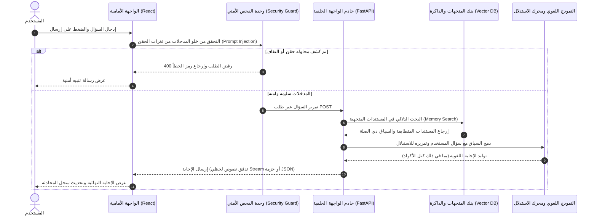
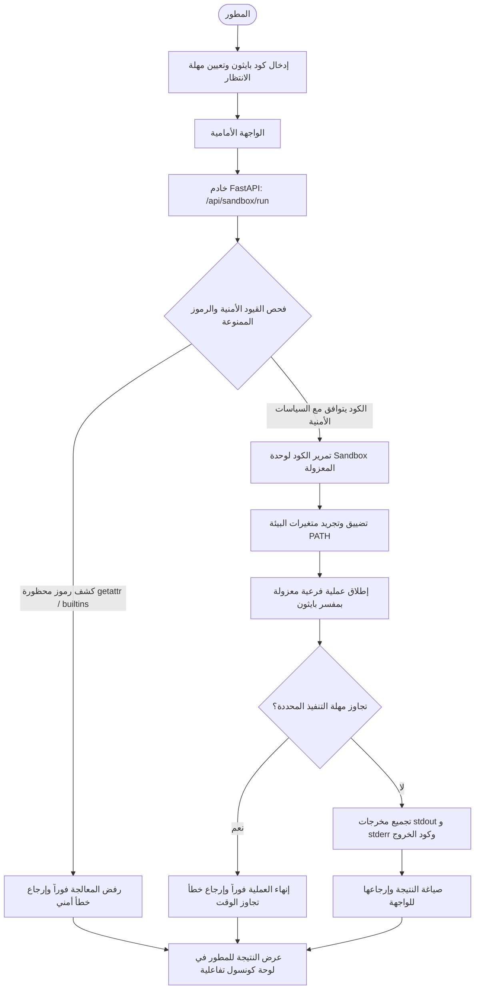
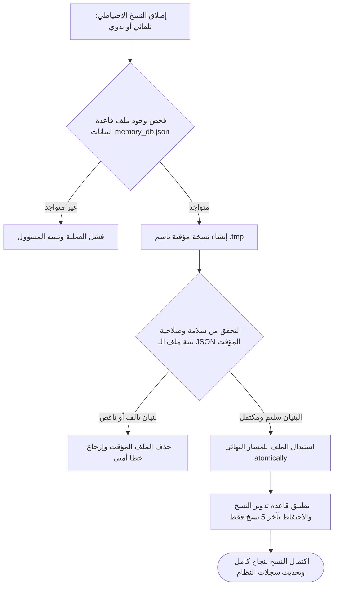

# تقرير سير العمليات وتدفق البيانات (Business & Data Flows) - Phoenix AI

يوضح هذا المستند مخططات سير العمليات الأساسية وتدفق البيانات (Business Flows) لمنصة **Phoenix AI** لبيئات التشغيل.

---

## 1. مخطط تدفق المحادثة وسياق الـ RAG (Chat & RAG Data Flow)

يوضح المخطط التالي دورة حياة طلب المستخدم للحصول على إجابة مدعومة ببيانات الذاكرة المتجهية:

---

## 2. مخطط تدفق فحص وتشغيل الأكواد المعزولة (Sandbox Run Flow)

يوضح هذا المخطط كيفية معالجة طلبات تشغيل الأكواد برمجياً وبشكل معزول:

---

## 3. مخطط تدفق النسخ الاحتياطي والتعافي (Disaster Recovery Flow)

