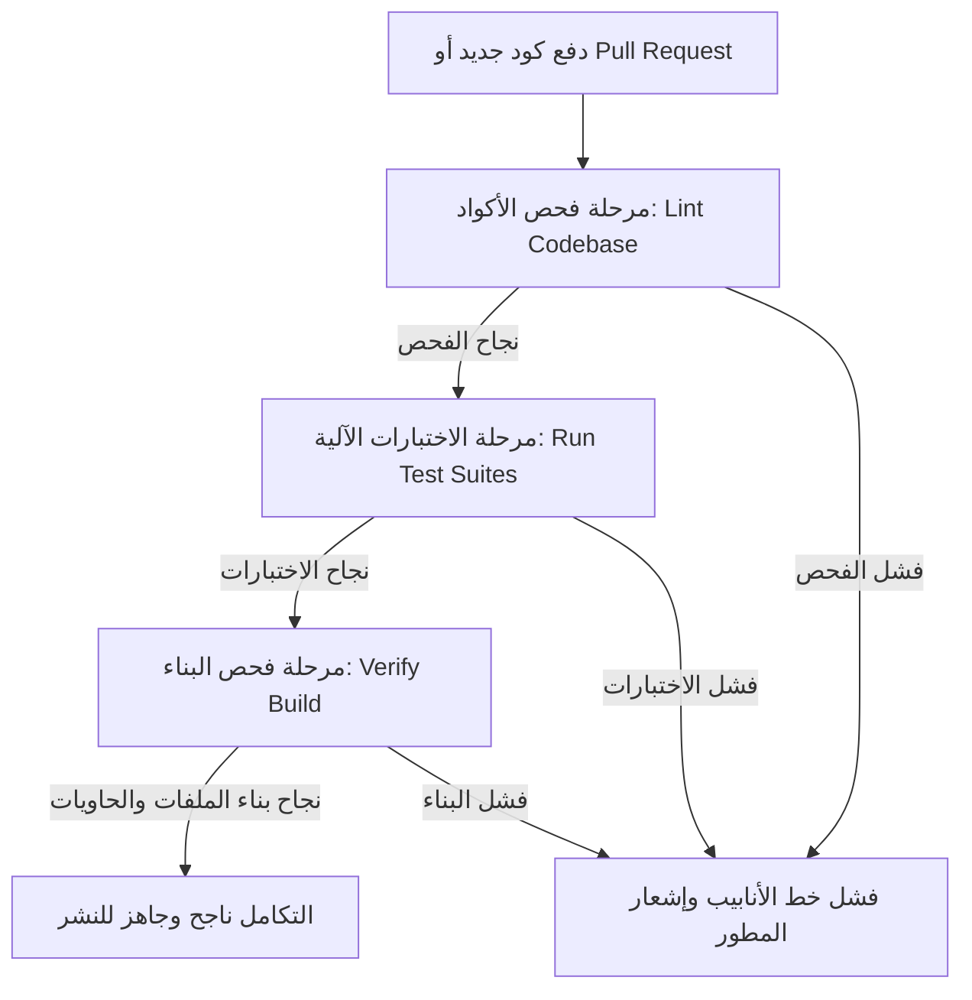

# تقرير خط التكامل والتسليم المستمر (CI/CD Report) - Phoenix AI

يوضح هذا التقرير تفاصيل تصميم وتهيئة خط التكامل المستمر (CI/CD Pipeline) لمنصة **Phoenix AI** لضمان جودة الأكواد وخلوها من الأخطاء التشغيلية وصلاحيتها للبناء البرمجي قبل النشر.

---

## 1. بنية تدفق التكامل المستمر (Pipeline Workflow)

تم بناء أتمتة دورة حياة التطوير باستخدام **GitHub Actions**. يتم تشغيل خط الأنابيب تلقائياً في الحالات التالية:
* عند دفع (Push) تعديلات جديدة إلى فروع الإنتاج الأساسية (`main`, `master`).
* عند إنشاء طلب سحب (Pull Request) يستهدف الفروع الأساسية (`main`, `master`).

يتكون خط الأنابيب من ثلاث مراحل متتالية ومرتبطة برمجياً (Lint ➔ Test ➔ Build):

---

## 2. تفاصيل مراحل الأتمتة

### المرحلة الأولى: فحص وتنسيق الأكواد (Lint Stage)
* **الأداة المستخدمة**: `flake8` للغة البايثون.
* **آلية العمل**:
  1. التحقق الصارم من الأخطاء البرمجية الهيكلية أو المتغيرات غير المعرفة أو المشاكل النحوية (Syntax Errors) باستخدام مرشحات محددة (`E9, F63, F7, F82`). يؤدي أي خطأ في هذه المرحلة إلى إيقاف العملية فوراً.
  2. فحص التحذيرات التنسيقية العامة (Code Style Warnings) مثل طول الأسطر أو المسافات، ويتم تجميع الإحصائيات لعرضها دون التسبب في فشل البناء للتساهل مع التنسيقات غير الحرجة.

### المرحلة الثانية: الاختبارات الآلية (Test Stage)
تعتمد هذه المرحلة على نجاح مرحلة الفحص السابقة (`needs: lint`) وتقوم بتشغيل ثلاثة مجموعات فحص منفصلة:
1. **الاختبارات الأساسية للمنصة (`pytest tests/`)**: تغطي المحرك اللغوي، المفسر، بنك الذاكرة المتجهية RAG، معالجة الاستثناءات، حماية حقن الأوامر والبرومبت، وتحديد معدل الطلبات.
2. **اختبارات مدير المهام (`pytest task_manager/tests/`)**: التحقق من جدولة المهام ومعالجة العمليات في الخلفية.
3. **اختبارات المهام الخلفية (`pytest phoenix_tasks/backend/tests/`)**: للتحقق من أمان الأدوار (RBAC) والتحقق الوظيفي للواجهة الخلفية الإضافية.

### المرحلة الثالثة: التحقق من البناء البرمجي (Build Stage)
تتأكد هذه المرحلة من قدرة المنصة على البناء الفعلي والتشغيل داخل الحاويات (`needs: test`):
* **بناء الواجهة الأمامية**: تهيئة بيئة Node.js 18 وتثبيت حزم الاعتماديات لبناء تطبيق React + Vite لضمان خلو الأكواد من أخطاء الترجمة أو الاستيراد.
* **محاكاة بناء الحاويات (Docker Dry Run)**:
  * بناء صورة خادم الواجهة الخلفية (`Dockerfile.backend`) والتأكد من تثبيت الاعتماديات وإعداد المتغير البيئي `PYTHONPATH`.
  * بناء صورة خادم الواجهة الأمامية (`Dockerfile.frontend`) والتأكد من تكامل مرحلتي البناء (Node.js) والتقديم عبر (Nginx).

---

## 3. التحقق المحلي وإثبات النجاح

تمت محاكاة جميع الخطوات محلياً للتأكد من موثوقية التغييرات:
1. **الفحوصات البرمجية**: نجاح كامل لجميع الفحوصات البالغ عددها **81 فحصاً** بنسبة 100%.
2. **بناء الواجهة الأمامية**: تم تشغيل `npm run build` بنجاح كامل وصدرت ملفات الواجهة المترجمة في مسار `ai_project/dashboard/dist` بزمن بناء قياسي قدره **834 ميلي ثانية**.

ملف إعداد خط الأنابيب المعتمد: [.github/workflows/ci.yml](file:///c:/Users/1/Desktop/7070/.github/workflows/ci.yml)
