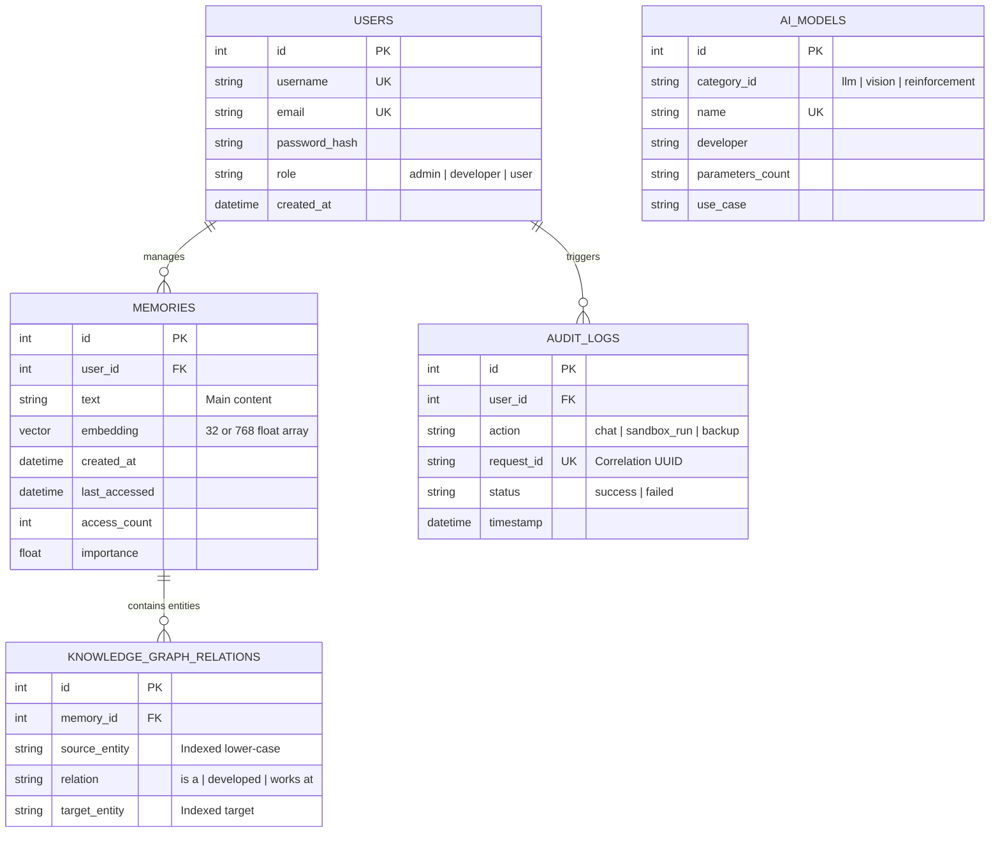

# تقرير خطط البيانات الهيكلية (Database ERD Report) - Phoenix AI

يوضح هذا المستند مخطط علاقات الكيانات وقاعدة البيانات (ERD) لمنصة **Phoenix AI** لبيئة الإنتاج المقترحة.

---

## 1. مخطط علاقات الكيانات باستخدام Mermaid (Mermaid ERD)

نظرًا لأن المنصة تعتمد حاليًا على ملفات JSON وتتطلع للتوسع المؤسسي، فإن المخطط الهيكلي المقترح للعلاقات وقواعد البيانات يتضمن الجداول التالية:

---

## 2. تفاصيل الجداول والحقول البرمجية (Schema Definition)

### أ. جدول المستخدمين (`USERS`)
* يضمن تفريد الهويات وتحديد الصلاحيات للحد من الاستخدام العشوائي وحماية خصوصية بيانات الـ RAG والذاكرة المخصصة لكل مستخدم.

### ب. جدول الذاكرة والوثائق المتجهية (`MEMORIES`)
* يتضمن الحقل `embedding` من نوع المتجهيات (Vector Column) لدعم عمليات البحث وحساب الفروقات المتجهية.
* حقول تتبع الاستخدام (`access_count`, `last_accessed`, `importance`) تستخدم لفرز السجلات دلالياً وتدوير البيانات وحذف القديم غير الفعال.

### ج. جدول علاقات الرسم البياني للمعرفة (`KNOWLEDGE_GRAPH_RELATIONS`)
* يربط الكيانات وعلاقاتها مع مصادر المستندات والذكريات الأصلية في جدول `MEMORIES`.
* يتضمن فهارس مخصصة (Indexes) على الحقول `source_entity` و `target_entity` لتسريع عمليات تتبع العلاقات بالاستعلامات الكبرى.
