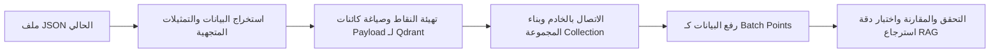

# تقرير دراسة مقارنة قواعد بيانات المتجهات (Vector Database Evaluation & Migration) - Phoenix AI

يوضح هذا المستند تقييماً ومقارنة مفصلة لخمسة من أشهر محركات قواعد بيانات المتجهات لتحديد المعمارية الأنسب لمنصة **Phoenix AI** وتفصيل خطة الانتقال إليها.

---

## 1. دراسة المقارنة الفنية (Vector Databases Comparison)

| محرك قواعد بيانات المتجهات | نمط التشغيل (Deployment Mode) | دعم التصفية الفوقية (Payload Filtering) | كفاءة التحجيم والبيانات الضخمة | التعقيد والصيانة التشغيلية |
| :--- | :--- | :---: | :---: | :--- |
| **Qdrant** | خدمة حاويات (Docker/Cloud) أو نمط محلي خفيف | **ممتاز وقوي جداً** | **مرتفع جداً** | متوسط. خيار مثالي للبيئات المؤسسية والمطورين معاً. |
| **FAISS** | مكتبة برمجية محلية (NumPy-based) | محدود (يحتاج فلترة خارجية) | مرتفع (أداء سريع جداً) | منخفض. لكنه يواجه صعوبة عند الحاجة لتحديث الفهارس ديناميكياً. |
| **Chroma** | مكتبة محلية مدمجة أو خدمة خادم | متوسط | متوسط | منخفض جداً. سهل البدء لكن أداءه يتراجع مع ملايين المتجهات. |
| **Milvus** | معمارية سحابية موزعة معقدة | ممتاز | مرتفع جداً (أكثر ملاءمة للبيئات العملاقة) | مرتفع جداً. يتطلب عدة مكونات تشغيلية (Kubernetes, MinIO, etcd). |
| **Pinecone** | سحابي بالكامل (SaaS Only) | ممتاز | مرتفع جداً | منخفض (مُدار بالكامل). لكنه يفتقر للعمل بدون إنترنت (Offline-First). |

---

## 2. التوصية الهندسية المعتمدة (Architectural Recommendation)

> [!TIP]
> التوصية المعتمدة لترقية المنصة هي **Qdrant**.

### أسباب اختيار Qdrant:
1. **المرونة التشغيلية (Hybrid Mode)**: يمكن لـ Qdrant التشغيل محلياً بشكل مدمج في بايثون (In-memory/Local file index) أثناء مرحلة التطوير والـ Sandbox، مع إمكانية التحول الفوري للتشغيل كخدمة حاوية Docker مستقلة في بيئة الإنتاج دون تغيير منطق الأكواد.
2. **التصفية المتكاملة للبيانات الوصفية (Payload Filtering)**: يتيح Qdrant إجراء استعلامات سريعة لتصفية المستندات بناءً على تصنيفاتها أو معرفات المستخدمين (مثل جلب الذكريات من الفئة 'python' فقط) بالتزامن مع حساب تشابه المتجهات.
3. **التكامل مع HNSW**: يدعم Qdrant خوارزميات HNSW بشكل قياسي لبناء الفهارس وتصفحها بأقل استهلاك ممكن للذاكرة العشوائية.

---

## 3. خطة الهجرة والانتقال لقواعد بيانات المتجهات (Vector Migration Plan)

تم تصميم مسار للانتقال التدريجي لتجنب فقدان البيانات أو تعطل الخدمات:

### خطوات تنفيذ الهجرة البرمجية:
1. **تصدير البيانات الفعلي**: استخدام وحدة الهجرة [vector_migration.py](file:///c:/Users/1/Desktop/7070/ai_project/memory/vector_migration.py) لقراءة ملف `memory_db.json` وتوليد مصفوفة الكائنات المتوافقة مع Qdrant PointStruct.
2. **تجهيز المجموعة (Collection Construction)**: إنشاء مجموعة جديدة في Qdrant باسم `phoenix_memories` وتعيين حجم الأبعاد المساوية لأبعاد النموذج (32 بعداً في بيئة الاختبار الحالية، أو 768 بعداً عند ترقية النموذج).
3. **الرفع الذري**: إرسال البيانات بشكل دفعات (Batches) لضمان عدم استهلاك الذاكرة.
4. **تبديل مكون الاستدعاء**: استبدال دوال البحث الدلالي في [vector_db.py](file:///c:/Users/1/Desktop/7070/ai_project/memory/vector_db.py) لتتصل بـ Qdrant Client بدلاً من معالجة المصفوفات المحلية عبر PyTorch.
