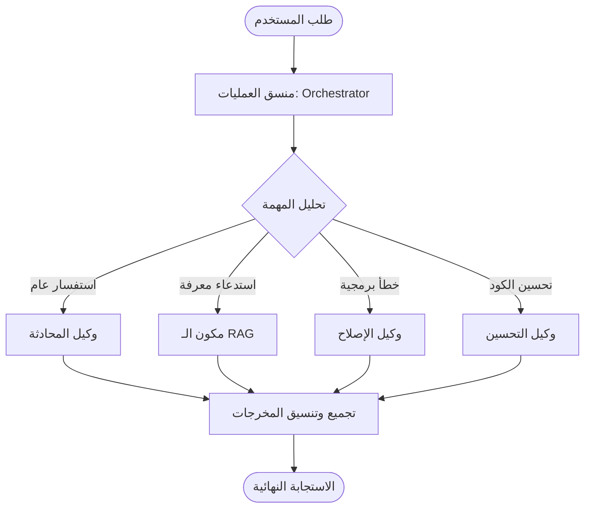

# تقرير محركات العمليات والتوجيه (Workflow & Orchestration Report) - Phoenix AI

يوضح هذا المستند تقييماً للبنية الحالية لتنسيق المهام وتدفق العمليات والوكلاء الأذكياء (Agents) في منصة **Phoenix AI** وتفاصيل تكوينها.

---

## 1. الهيكل الحالي لتنسيق العمليات (Orchestration & Routing)

تعتمد المنصة على مكون برمجي أساسي لتنسيق وإدارة مهام المساعد الذكي:
* **منسق العمليات ([orchestrator.py](file:///c:/Users/1/Desktop/7070/ai_project/agents/orchestrator.py))**:
  * يستقبل الطلبات المعقدة من المستخدمين.
  * يحلل طبيعة المهمة ويقسمها إلى مهام فرعية (Sub-tasks).
  * يوجه المهام الفرعية للوكلاء المتخصصين:
    * **وكيل المحادثة (PhoenixAgent)**: للمحادثة العامة والبحث.
    * **وكيل البحث بالذاكرة (RAGPipeline)**: لاستدعاء السياق من بنك الذاكرة المتجهية.
    * **وكيل الإصلاح (PhoenixDebuggerAgent)**: لإصلاح أخطاء ملفات المشروع.
    * **وكيل تحسين الأكواد (PhoenixRefactorAgent)**: لإعادة الهيكلة والتنسيق.
  * يجمع النتائج من الوكلاء ويعيد صياغتها كإجابة موحدة للمستخدم النهائي.

---

## 2. نظام التوجيه بالذاكرة (Memory & Vector Routing)

* **التوجيه الهجين (Hybrid Search)**: يجمع النظام بين محرك التوجيه المتجهي القائم على الجيب (Cosine Similarity) وبين محرك التصفية النصي (BM25) لضمان مطابقة الكلمات المفتاحية والجمل الدلالية معاً باستخدام Reciprocal Rank Fusion (RRF).
* **التوجيه بالرسم البياني للمعرفة (Graph RAG)**: يتم استخراج الكيانات والعلاقات وتوجيه الاستعلامات إلى الرسم البياني للمعرفة المعرفية `kg_graph` في قاعدة البيانات لربط العلاقات غير المباشرة وتضمينها في السياق.

---

## 3. الفجوات المرصودة في نظام تدفق العمليات (Orchestration Gaps)

1. **غياب الأطر المتقدمة (LangChain/LangGraph)**: تم بناء آليات التوجيه والمنسق بشكل يدوي خطي، مما يصعب نمذجة العمليات التشغيلية الدائرية (Cyclic Graphs) أو بناء مسارات تصحيح ذاتية متقدمة كما توفرها أطر عمل مثل LangGraph.
2. **غياب إدارة الأدوات الخارجية (Tool Calling)**: تفتقر المنصة لنظام استدعاء واجهات البرمجة الخارجية بشكل تلقائي ديناميكي (Dynamic Tool Calling/Execution)، وتكتفي بتشغيل الأكواد المعزولة محلياً.
3. **غياب آلية التراجع الآمن (Fallback Logic)**: في حال فشل استخلاص البيانات أو فشل توليد النموذج، لا يتوفر مسار تراجع ديناميكي (Fallback) لتمرير الاستعلام لنموذج خارجي أو بديل احتياطي.
